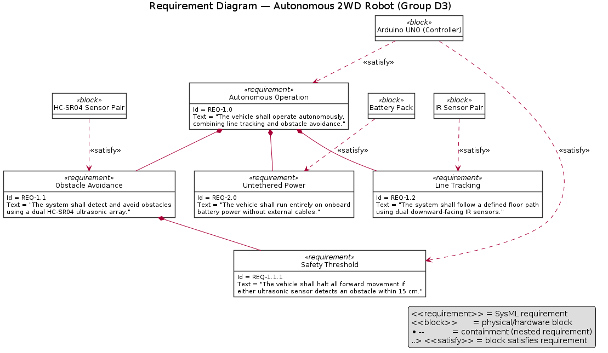
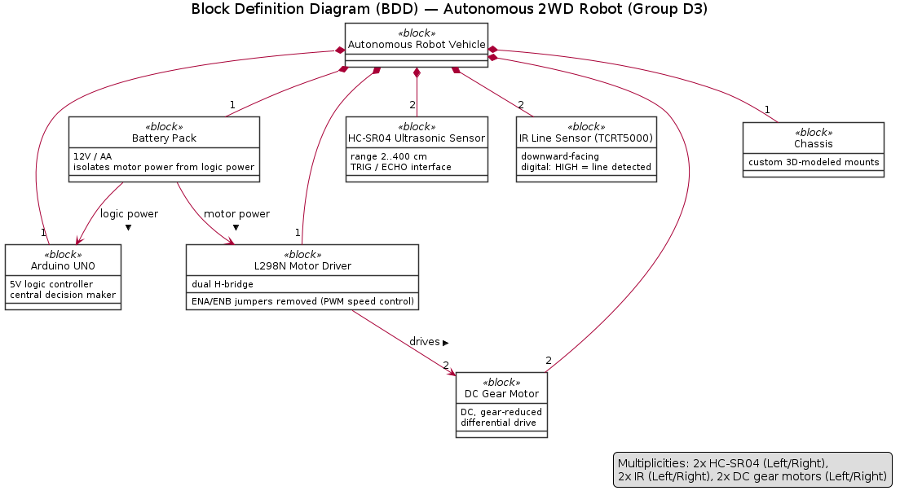
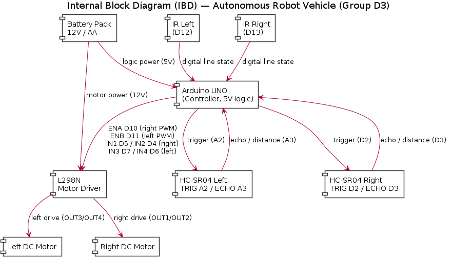
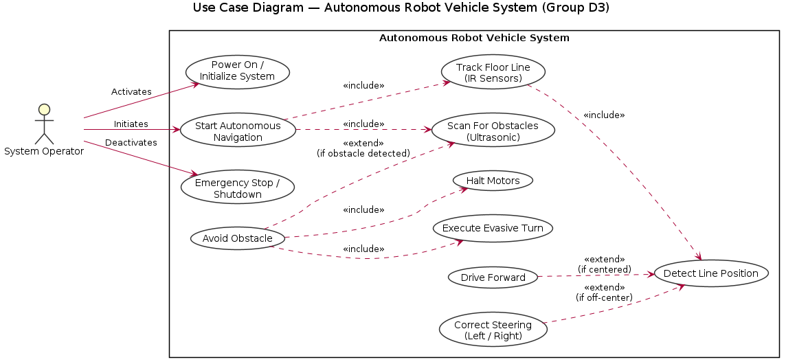
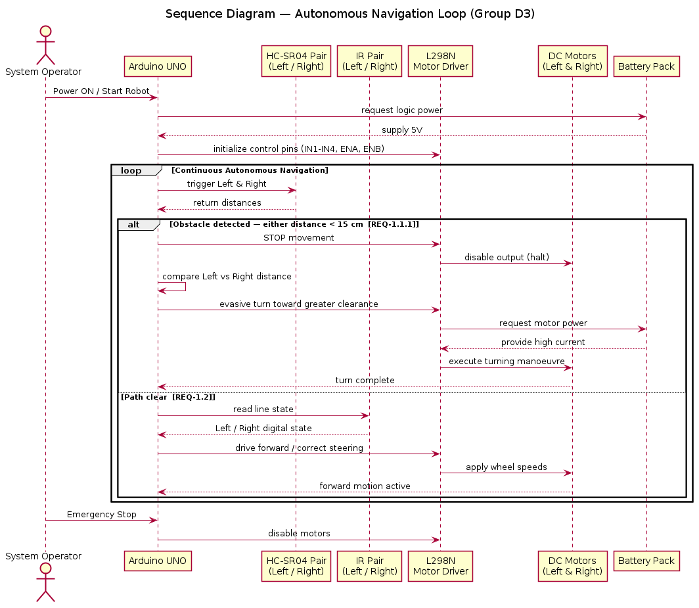
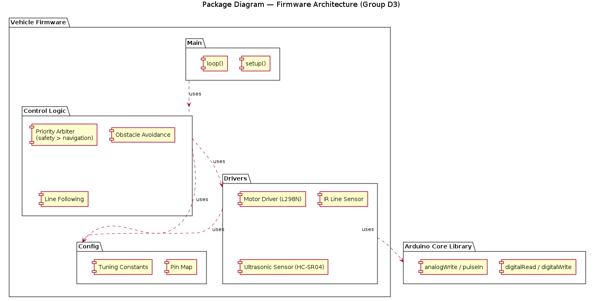

# Prototyping-D3 — Systems Engineering (SysML) Documentation

This folder contains the SysML model set for **Group D3's autonomous 2WD robot vehicle**: an untethered, battery-powered car that operates as a hybrid **line follower** and **obstacle avoider**.

The system follows a strict **safety-first priority**: obstacle detection (safety) always overrides line tracking (navigation). Each loop executes a *Sense → Decide → Act* pipeline — read the ultrasonic sensors first, and only fall through to IR line tracking when the path ahead is clear.

---

## Diagram Index

| # | Diagram | Purpose |
|---|---------|---------|
| 01 | Requirement Diagram | Autonomous-operation requirement tree and hardware `«satisfy»` mapping |
| 02 | Block Definition Diagram (BDD) | System composition and part multiplicities |
| 03 | Internal Block Diagram (IBD) | Internal signal/power connectors with Arduino pin allocation |
| 04 | Use Case Diagram | Operator interactions and parallel scan/track behaviors |
| 05 | Sequence Diagram | Runtime timeline of one navigation loop |
| 06 | Activity Diagram | `void loop()` control flow as an if/else flowchart |
| 07 | Package Diagram | Firmware architecture (config, drivers, control logic, main) |

---

## 01 — Requirement Diagram

Captures the top-level requirement **REQ-1.0 (Autonomous Operation)** and its decomposition into obstacle avoidance, line tracking, untethered power, and the 15 cm safety threshold. Each hardware block is linked to the requirement it satisfies.

## 02 — Block Definition Diagram (BDD)

Defines the vehicle as a composition of its blocks — controller, motor driver, motors, sensors, battery, and chassis — with multiplicities (2× HC-SR04, 2× IR, 2× DC gear motors).

## 03 — Internal Block Diagram (IBD)

Shows the internal wiring: power distribution from the battery and control/sensing connectors between the Arduino, L298N driver, motors, and both sensor pairs, annotated with the physical pin assignments.

## 04 — Use Case Diagram

Models the System Operator's interactions (power-on, start navigation, emergency stop) and the internal `«include»` / `«extend»` behaviors for line tracking and obstacle scanning.

## 05 — Sequence Diagram

Details the message timeline of a single autonomous navigation loop, including the safety-priority branch (halt → compare distances → evasive turn) and the motor-power request handshake with the battery.

## 06 — Activity Diagram

The algorithmic flowchart of `void loop()`: the safety-first gate that reads both ultrasonic sensors, halts and turns toward the greater clearance on detection, and otherwise falls through to IR-based line correction.

## 07 — Package Diagram

The firmware's software architecture, separating the Arduino core library from the project's Config, Drivers, Control Logic, and Main packages.

---

## Hardware Reference

| Subsystem | Signal | Arduino Pin |
|-----------|--------|-------------|
| IR line sensor — Left | digital | D12 |
| IR line sensor — Right | digital | D13 |
| Right motor | ENA (PWM) / IN1 / IN2 | D10 / D5 / D4 |
| Left motor | ENB (PWM) / IN3 / IN4 | D11 / D7 / D6 |
| Ultrasonic — Left | TRIG / ECHO | A2 / A3 |
| Ultrasonic — Right | TRIG / ECHO | D2 / D3 |

**Core platform:** Arduino UNO (5V logic) · L298N dual H-bridge (ENA/ENB jumpers removed for PWM) · 2× DC gear motors · 2× HC-SR04 · 2× IR line sensors · 12V/AA battery pack (motor power isolated from logic). Obstacle safety threshold: **15 cm**.

---

## Requirements Traceability

| ID | Requirement | Satisfied By |
|----|-------------|--------------|
| REQ-1.0 | Operate autonomously, combining line tracking and obstacle avoidance | Arduino UNO |
| REQ-1.1 | Detect and avoid obstacles using a dual HC-SR04 array | HC-SR04 sensor pair |
| REQ-1.1.1 | Halt all forward movement if either sensor detects an obstacle within 15 cm | Arduino UNO + HC-SR04 pair |
| REQ-1.2 | Follow a defined floor path using dual downward-facing IR sensors | IR sensor pair |
| REQ-2.0 | Run entirely on onboard battery power without external cables | Battery pack |

---

## Team — Group D3

MD Afif Hasan · Rei Halilaj · Ambrose · Jubayer Ahmed

*Systems Engineering / Prototyping project — Hochschule Hamm-Lippstadt*
