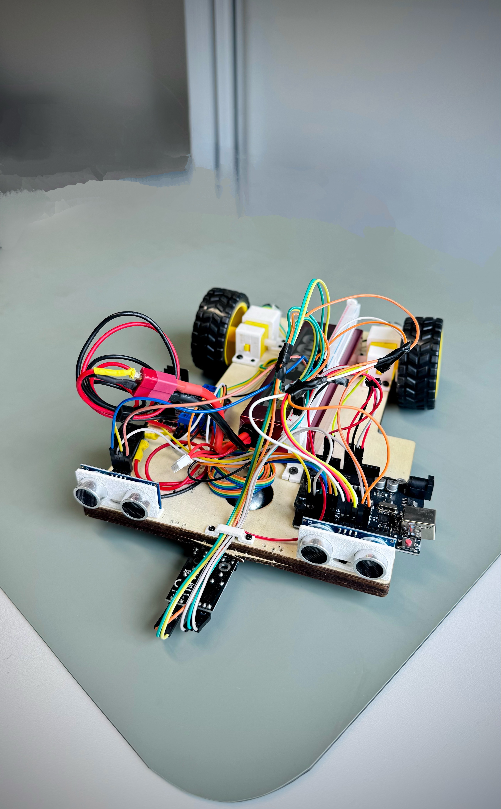
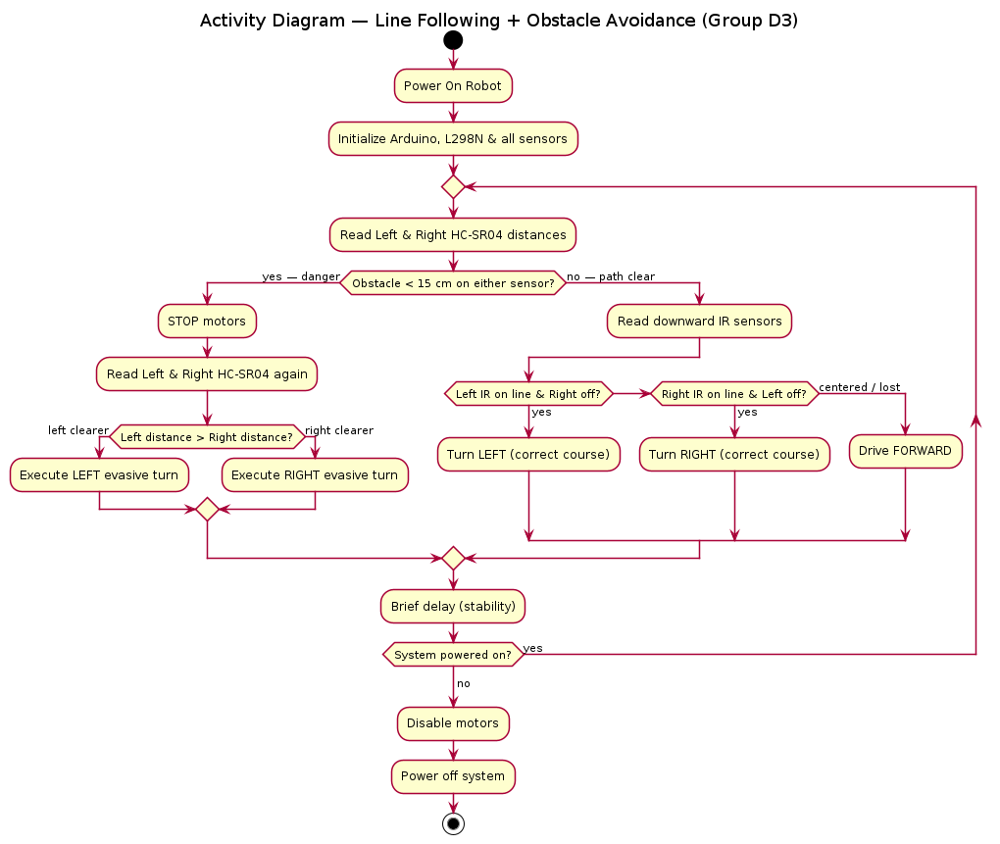

# Prototyping-D3 — Autonomous 2WD Robot Vehicle

An **untethered, two-wheel-drive robot car** that operates as a hybrid **line follower** and **obstacle avoider**. The vehicle follows a strict safety-first priority: obstacle detection (safety) always overrides line tracking (navigation).

---

## Overview

Built for the Systems Engineering / Prototyping module at **Hochschule Hamm-Lippstadt**, this project pairs a formal **SysML model** with a physically assembled Arduino prototype. Every loop follows a *Sense → Think → Act* pipeline: read the ultrasonic sensors first, and only fall through to IR line tracking when the path ahead is clear.

**Key features**

- Hybrid **line following + obstacle avoidance** on a single Arduino UNO
- **Safety-first priority gate** — obstacle avoidance pre-empts navigation every cycle
- **Dual HC-SR04** front sensors for obstacle detection and evasive manoeuvres
- **Dual downward IR** sensors for line tracking
- **Isolated power** — motor current separated from Arduino logic supply
- Full **SysML documentation** and **custom 3D-modeled mounts**

---

## Repository Structure

| Path | Contents |
|------|----------|
| [`Codes/`](Codes) | Arduino firmware — 3 sketches (final, baseline, experimental) with its own README |
| [`Design/`](Design) | Mechanical CAD parts (STEP) with its own README |
| [`Diagrams/`](Diagrams) | **Current** SysML diagram set (7 PNGs) with its own README |
| `zz_diagrams_archive/` | Superseded diagrams — kept for history only, ignore (current set is in `Diagrams/`) |
| `GroupD3_Wiring_Schematic.pdf` | Full wiring / circuit schematic |
| `GroupD3_Vehicle_Assembly.JPG` | Photo of the assembled prototype |

---

## Hardware Architecture

| Component | Part | Role |
|-----------|------|------|
| Microcontroller | 1× Arduino UNO (Joy-IT), 5V logic | Central decision maker |
| Motor Driver | 1× L298N Dual H-Bridge | Drives motors; ENA/ENB jumpers removed for PWM |
| Actuators | 2× DC gear motors (rubber tread) | Left / right differential drive |
| Obstacle Sensors | 2× HC-SR04 ultrasonic | Front-Left / Front-Right distance |
| Tracking Sensors | 2× IR line sensors | Downward-facing line detection |
| Power | 12V / AA battery pack | Motor power isolated from logic power |

### Pin Map

| Subsystem | Signal | Arduino Pin |
|-----------|--------|-------------|
| IR line sensor — Left | digital | D12 |
| IR line sensor — Right | digital | D13 |
| Right motor | ENA (PWM) / IN1 / IN2 | D10 / D5 / D4 |
| Left motor | ENB (PWM) / IN3 / IN4 | D11 / D7 / D6 |
| Ultrasonic — Left | TRIG / ECHO | A2 / A3 |
| Ultrasonic — Right | TRIG / ECHO | D2 / D3 |

> **IR polarity:** `HIGH` = line detected (consistent across all sketches). **Obstacle threshold:** 15 cm.

---

## Control Logic (Sense → Think → Act)

The `void loop()` executes a two-tier priority hierarchy:

**Priority 1 — Obstacle Avoidance (safety)**
Read both HC-SR04 sensors. If an obstacle is detected within the **15 cm** threshold, the vehicle halts and executes an evasive manoeuvre around the object, then re-acquires and rejoins the line before resuming.

**Priority 2 — Line Tracking (navigation)**
If the path is clear, read the IR sensors and correct course — turn toward the sensor that detects the line, or drive straight when centered.

Full behavioral and architectural models are in [`Diagrams/`](Diagrams): Requirement, BDD, IBD, Use Case, Sequence, Activity, and Package diagrams.

---

## Firmware — Build & Upload

All sketches live in [`Codes/`](Codes):

| Sketch | Purpose |
|--------|---------|
| `GroupD3_AutonomousVehicle_Final.ino` | **Final build** — line following + obstacle avoidance |
| `GroupD3_LineFollower_Baseline.ino` | Stable line-following baseline (Milestone 1) |
| `GroupD3_LineFollower_Fast_Experimental.ino` | Experimental higher-speed variant (reference only) |

**Steps** — requires the [Arduino IDE](https://www.arduino.cc/en/software) (1.8+ or 2.x):

1. Open `Codes/GroupD3_AutonomousVehicle_Final.ino` (the full build).
2. Select **Tools → Board → Arduino UNO**.
3. Select the correct **Port** under **Tools → Port**.
4. Wire the hardware per the Pin Map above (or `GroupD3_Wiring_Schematic.pdf`).
5. Power the L298N from the battery pack; **do not** back-feed motor voltage through the Arduino's USB.
6. Click **Upload**.

**Bench-test tips**

- Verify IR sensor polarity before driving — inverted line logic is the most common failure mode here.
- Confirm ultrasonic timing is intact (avoid Timer0 modifications, which distort `delay()`/`pulseIn()` used by HC-SR04).
- Test line following and obstacle avoidance in isolation before running the hybrid loop.

---

## Documentation

| Document | Location |
|----------|----------|
| Firmware (Arduino) | [`Codes/`](Codes) |
| SysML diagram set (7) | [`Diagrams/`](Diagrams) |
| Mechanical CAD (STEP) | [`Design/`](Design) |
| Circuit schematic | `GroupD3_Wiring_Schematic.pdf` |

---

## Project Milestones

- **Milestone 1 — Lane Following** ✅ Vehicle follows the track via IR line detection.
- **Milestone 2 — Obstacle Avoidance** ✅ HC-SR04 avoidance layered on the confirmed line-following base.

---

## Team — Group D3

| Member | GitHub |
|--------|--------|
| Md Afif Hasan | [@HASAN-AFIF720](https://github.com/HASAN-AFIF720) |
| Jubayer Ahmed | [@MainReturn0](https://github.com/MainReturn0) |
| Rei Halilaj | [@ReiHalilaj](https://github.com/ReiHalilaj) |
| Ambrose | — |

*Systems Engineering / Prototyping project — Hochschule Hamm-Lippstadt*

---

## License

Academic coursework, shared for educational reference. If you intend to reuse this work, please credit Group D3 and consider adding an explicit open-source license (e.g. MIT) to the repository.
